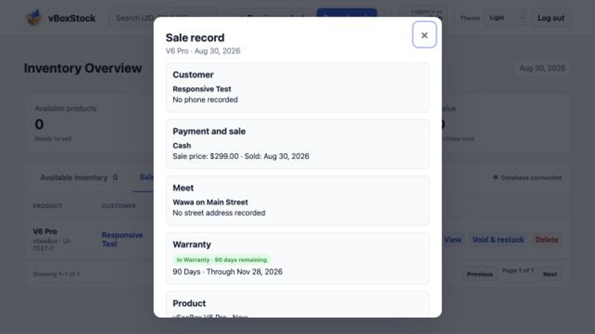
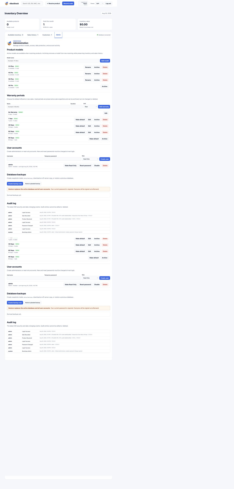
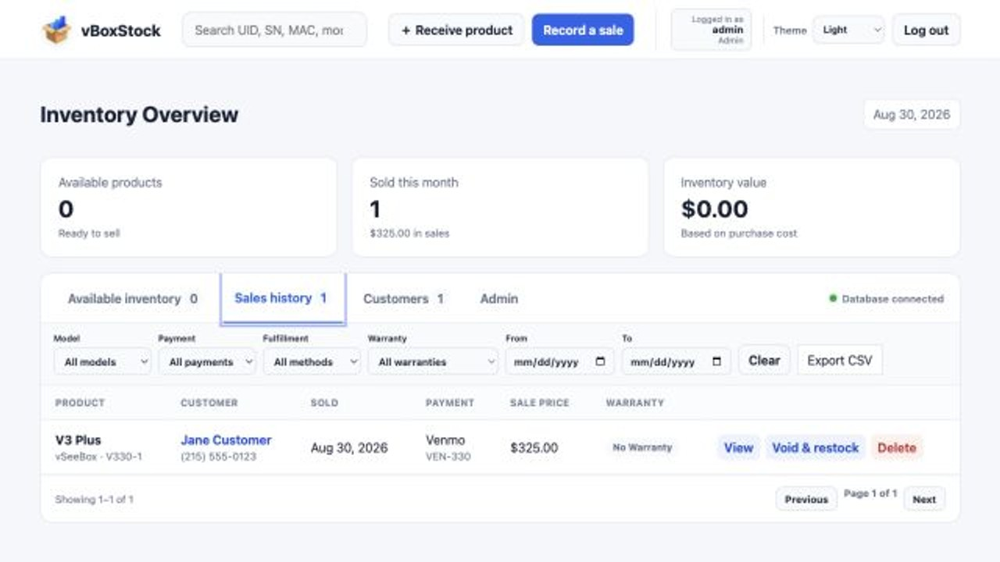
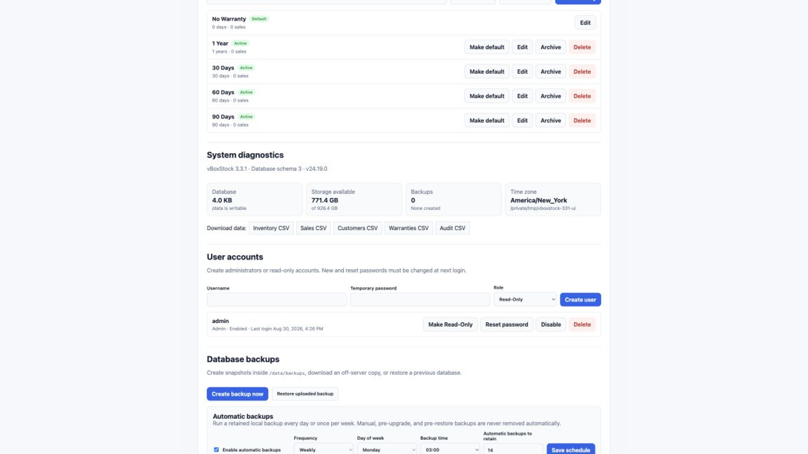
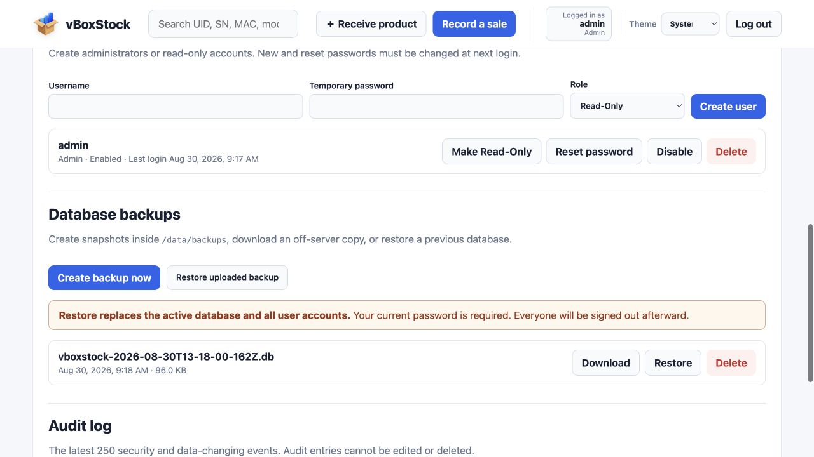
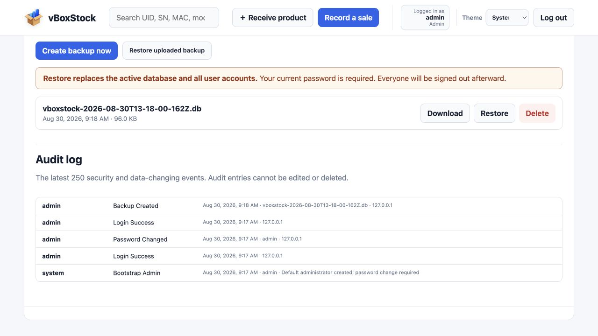

<p align="center"></p>

# vBoxStock

A small, self-hosted inventory and sales tracker for people who buy, stock, and resell vSeeBox devices.

vBoxStock replaces spreadsheets and handwritten lists with one browser-based place to track each physical unit from receipt through sale. It records the identifiers that matter for electronics inventory—UID, serial number, and MAC address—along with condition, cost, customer, payment, shipping, and support history.

It was developed with Unraid in mind, but Unraid is not required. vBoxStock is a standard OCI/Docker container and can run on a Docker-compatible Linux server, NAS, home lab, or cloud VM. The application is self-contained: the web server and SQLite database live inside one image, while durable data is stored in a mounted `/data` directory.


## Why vBoxStock exists

General inventory tools can be larger and more complicated than a small reseller needs. vBoxStock focuses on a straightforward workflow:

1. Receive an individually identifiable device into inventory.
2. Record its cost, model, condition, and notes.
3. Complete a sale with customer, payment, fulfillment, warranty, and transaction details.
4. Revisit the customer or sale later for support and follow-up.
5. Back up the complete business record without managing a separate database server.

## Highlights

- Track available and sold devices by UID, serial number, or MAC address.
- Start with vSeeBox V3 Plus, V5 Pro, V6 Plus, and V6 Pro, then add any additional model you carry.
- Manage the model catalog from the Admin page: rename unused models, archive end-of-life models, reactivate them later, or delete models that have never been used.
- Record New, Used, or Refurbished condition and purchase cost.
- Record whether a product was shipped, dropped off, installed, or exchanged at a meetup using fields tailored to that method.
- Capture shipping carriers, tracking numbers, direct official tracking links, and an editable delivery status.
- Configure warranty periods in Admin and see live green in-warranty countdowns or red expired indicators throughout sale history.
- Keep shipped-to and installed-at addresses while allowing venue or notes-based details for drop-offs and meetups.
- Record Cash, Venmo, or PayPal payments with an optional reference.
- Attach transaction notes to a sale and time-stamped support notes to a customer.
- Browse inventory, sales, and customers in searchable 10-record pages.
- Filter records by model and date, with additional payment, fulfillment, and warranty filters for sales.
- Export inventory, sales, customers, warranty configuration, and audit history to CSV.
- View sale details and complete purchase history for each customer.
- Select returning customers during a sale and safely correct all transaction details afterward.
- Void a sale and return the device to available inventory.
- Use Admin and Read-Only accounts with server-enforced permissions.
- Create, download, restore, and delete SQLite backups from the Admin page.
- Schedule automatic daily backups with configurable retention and review storage/database diagnostics.
- Review an audit log of authentication, account administration, backups, and data changes.
- Keep all persistent application data in one mounted directory.

## Screenshots

### Secure sign-in


### Product model administration


### Fulfillment and warranty tracking



### Warranty administration



### Sales filters and CSV export



### System diagnostics and scheduled backups



### User administration and database backups



### Audit history



## Accounts and security

On a new installation—or an upgraded installation with no configured accounts—sign in with:

- **Username:** `admin`
- **Password:** `admin`

vBoxStock immediately requires a new password and blocks access to application data until it is changed. Passwords must contain at least 8 characters and are stored as salted `scrypt` hashes, never as readable text.

| Capability | Admin | Read-Only |
| --- | :---: | :---: |
| View and search inventory, sales, customers, and notes | Yes | Yes |
| Receive inventory and record sales | Yes | No |
| Edit fulfillment, tracking, warranty, and transaction details | Yes | No |
| Edit notes, void sales, or delete records | Yes | No |
| Manage product models, users, and view the audit log | Yes | No |
| Create, download, delete, or restore backups | Yes | No |
| Access the Admin page | Yes | No |

Additional protections include HTTP-only SameSite session cookies, a 12-hour inactivity timeout, login throttling, required password confirmation before a restore, automatic session invalidation after a restore, and protection against disabling or deleting the final enabled administrator.

For use outside a trusted private network, place vBoxStock behind an HTTPS reverse proxy. The application does not provide TLS certificates directly.

## Quick start with Docker

On a typical Linux Docker host, create a persistent data directory and run vBoxStock using the UID and GID of the current user:

```sh
mkdir -p vboxstock-data

docker run -d \
  --name vboxstock \
  --restart unless-stopped \
  -p 8269:3000 \
  -e TZ=America/New_York \
  -e PUID="$(id -u)" \
  -e PGID="$(id -g)" \
  -v "$PWD/vboxstock-data:/data" \
  ghcr.io/mfwadejr/vboxstock:latest
```

Open `http://YOUR-SERVER-IP:8269`, sign in with the initial credentials above, and change the password when prompted. Port `8269` is the recommended host port; it maps to vBoxStock's internal container port `3000`.

The host path mounted at `/data` is essential. Removing the container is safe when this mount remains intact; running without a persistent mount means the database can be lost when the container is replaced. `PUID` and `PGID` determine which host user and group own the database and backup files. They should match the account that owns the host-side data directory.

Typical identity settings:

| Platform | PUID | PGID | Guidance |
| --- | ---: | ---: | --- |
| General Linux Docker | Output of `id -u` | Output of `id -g` | The quick-start command determines these automatically. |
| Docker Desktop on macOS or Windows | `1000` | `1000` | Normally suitable because bind-mount permissions are mediated by Docker Desktop. |
| ZimaOS | `1000` | `1000` | Included in `docker-compose.zimaos.yml`. |
| Unraid | `99` | `100` | Maps to Unraid's standard `nobody:users` ownership. |

These values control file ownership only; they are not vBoxStock login credentials.

## Docker Compose

The included `docker-compose.yml` has the explicit project name `vboxstock` and stores data in `./data` alongside the Compose file. Its identity values can be overridden with `PUID`, `PGID`, and `TZ`; otherwise it uses the common general-Docker defaults `1000:1000` and `America/New_York`:

```sh
docker compose up -d
```

The `docker run` example above is a terminal command. Do not paste it into a Compose or YAML editor; use the Compose file instead.

To update later:

```sh
docker compose pull
docker compose up -d
```

## ZimaOS

Use [`docker-compose.zimaos.yml`](docker-compose.zimaos.yml) with ZimaOS's custom app/Compose installer. It includes the required `vboxstock` project name, ZimaOS dashboard metadata, the application icon, and a persistent data mapping to `/DATA/AppData/vboxstock`.

If entering the configuration manually, replace any ZimaOS-generated `<your project name>` placeholder with `vboxstock`. The angle brackets and placeholder text must not remain in the saved YAML. Do not paste the `docker run` command into the YAML editor.

ZimaOS settings:

| Setting | Value |
| --- | --- |
| Project name | `vboxstock` |
| Image | `ghcr.io/mfwadejr/vboxstock:latest` |
| WebUI host port | `8269` |
| Internal container port | `3000` |
| Container data path | `/data` |
| ZimaOS host path | `/DATA/AppData/vboxstock` |
| PUID | `1000` |
| PGID | `1000` |

After installation, open `http://YOUR-ZIMAOS-IP:8269`. The ZimaOS-specific Compose file supplies the icon automatically through its `x-casaos` metadata.

## Container icon

Use this direct PNG URL in ZimaOS, Unraid, Portainer, or another container dashboard that accepts a custom icon:

```text
https://raw.githubusercontent.com/mfwadejr/vboxstock/main/public/assets/vboxstock-icon-512.png
```

The included ZimaOS Compose file and Unraid XML template already contain this URL.

## Unraid

Use the included `vboxstock-unraid.xml` template or create a container with these settings:

| Setting | Value |
| --- | --- |
| Repository | `ghcr.io/mfwadejr/vboxstock:latest` |
| WebUI host port | `8269` |
| Internal container port | `3000` |
| Container data path | `/data` |
| Suggested Unraid host path | `/mnt/user/appdata/vboxstock` |
| Network mode | `bridge` |
| Timezone (`TZ`) | `America/New_York` |
| PUID | `99` |
| PGID | `100` |

Add `TZ`, `PUID`, and `PGID` as Unraid container variables:

| Name | Key | Value |
| --- | --- | --- |
| Timezone | `TZ` | `America/New_York` |
| User ID | `PUID` | `99` |
| Group ID | `PGID` | `100` |

Open the container's WebUI after installation. Updates can be applied with **Force Update** or through the CA Auto Update Applications plugin. At startup, the container creates `/data/backups`, applies the configured `PUID` and `PGID` ownership to `/data`, and then runs the application with those IDs.

## Data and backups

vBoxStock uses SQLite and does not require MySQL, PostgreSQL, Redis, or another service. Persistent content is stored under `/data`:

- `/data/vboxstock.db` — active application database
- `/data/backups/` — locally retained database snapshots

`/data` is the path inside the container. When `/mnt/user/appdata/vboxstock` is mapped directly to `/data`, the Unraid host folder contains `vboxstock.db` and `backups/`; it does not contain another nested folder named `data`.

A fresh installation creates an empty inventory, sales history, and customer list. Only the initial `admin` account is created. Replacing or upgrading the container preserves existing records because `vboxstock.db` remains in the mounted host folder. Removing or changing the `/data` mapping starts a separate empty database, so keep that mapping consistent across upgrades.

The Admin page can create a transactionally consistent snapshot, download it to another device, restore a local snapshot, or upload and restore a downloaded copy. A pre-restore snapshot is created automatically before the active database is replaced.

Daily automatic backups can be enabled under **Admin → System and data tools**. Choose a local-time hour from `0` through `23` and retain between 1 and 365 scheduled snapshots. Retention applies only to files named `scheduled-*.db`; manual, pre-upgrade, and pre-restore backups are never removed automatically. The application checks the schedule every 15 minutes and creates at most one scheduled backup per calendar day.

The same section reports application and database-schema versions, Node.js version, database size, `/data` writability, free disk space, configured time zone, and the latest backup. These checks are local to the container and do not transmit system information anywhere.

## Product model catalog

Administrators manage product models from **Admin → Product models**. Active models appear alphabetically in the Receive Product dropdown. Archiving a model removes it from that dropdown but does not change existing inventory, sales, customer history, or reports. Available units that use an archived model can still be sold, and an archived model can be reactivated at any time.

Model names are unique regardless of capitalization and may contain up to 60 characters. An unused model can be renamed or permanently deleted. Once a model has been used by an inventory or sales record, its name is preserved for historical accuracy; archive it and create a new model instead of renaming or deleting it. The Admin page displays separate available and sold usage counts before an archive is confirmed.

### Fulfillment and warranty records

Every new sale records a delivery method: **Shipped**, **Dropped Off**, **Installed At**, or **Meet**. Shipping and installation require an address. Drop-off and meetup records accept a venue, an optional address, or a descriptive fulfillment note, so locations such as a store or gas station do not become the customer's permanent address. Only Shipped and Installed At sales update the address shown on the customer record.

Shipped sales support UPS, FedEx, USPS, or Other, an optional tracking number, and a manually maintained delivery status. Recognized carriers receive a direct link to their official tracking page. Carrier websites are not scraped and delivery statuses are not fetched automatically.

Administrators manage reusable warranty periods under **Admin → Warranty periods**. The initial choices are No Warranty, 30 Days, 60 Days, 90 Days, and 1 Year. Custom durations can use days, months, or years, and one active period is the default for new sales. Once used, a period is preserved for historical accuracy and can be archived but not edited or deleted. Each sale stores the selected warranty and calculated end date as a snapshot; changing the default does not rewrite previous sales.

### Customer matching, filters, and exports

The sale form suggests existing customers by name and phone number. Selecting a suggestion reuses its customer ID, while the server also normalizes phone digits and names to reduce accidental duplicates. Meetup and drop-off locations remain sale-specific and do not overwrite a customer's permanent address.

Administrators can correct every sale field later, including customer, phone, date, price, payment, fulfillment, tracking, warranty, and notes. Changing the sale date recalculates the selected warranty end date. Inventory and sales can be filtered by model and date; sales also support payment, fulfillment, and warranty-status filters.

CSV downloads are available for inventory, sales, customers, and warranty configuration. Administrators can additionally export the security audit log. Exports are generated directly from the active database and do not use an external reporting service.

The model catalog is stored in `vboxstock.db`, so it is included automatically in every backup and restore. Schema-changing upgrades migrate the existing database in place and create a pre-upgrade safety backup in `/data/backups` when required.

Backups contain customer information and password hashes. Store downloaded copies securely. Restoring a database also restores the user accounts contained in that backup and signs out every active session. An older backup without user accounts starts the first-login `admin` / `admin` setup flow.

## Emergency administrator recovery

If every administrator is inaccessible, run this on the Docker host, replacing the container name, username, and temporary password if needed:

```sh
docker exec -it vboxstock node server.mjs reset-admin admin NewPassword123
```

The account is enabled as an administrator and must change the supplied password on its next login. The reset is recorded in the audit log. Because command arguments may briefly appear in process listings, the password can instead be supplied through an environment variable:

```sh
docker exec -e RESET_ADMIN_PASSWORD=NewPassword123 -it vboxstock node server.mjs reset-admin admin
```

## Container details

- Image: `ghcr.io/mfwadejr/vboxstock:latest`
- Application port: `3000/tcp`
- Recommended host port: `8269/tcp` (mapped to container port `3000`)
- Persistent volume: `/data`
- Runtime ownership: configurable with `PUID` and `PGID`; installation examples set platform-appropriate values. The image fallback is `99:100` for Unraid compatibility.
- Health check: `GET /api/health`
- Runtime: Node.js 22
- Database: SQLite
- Restart policy recommendation: `unless-stopped`

## Intended scope

vBoxStock is designed for a single reseller or small team operating one shared installation. It is not an accounting platform, payment processor, shipping-label service, or public storefront. Payment details are records of how a sale was accepted; vBoxStock does not connect to Cash, Venmo, or PayPal or move money itself.

## Updating and versioning

The `latest` image follows the current stable release. Patch releases contain fixes and small refinements, minor releases add backward-compatible features, and major releases may change setup or access behavior. Keep `/data` persistently mounted and create or download a backup before significant upgrades.
