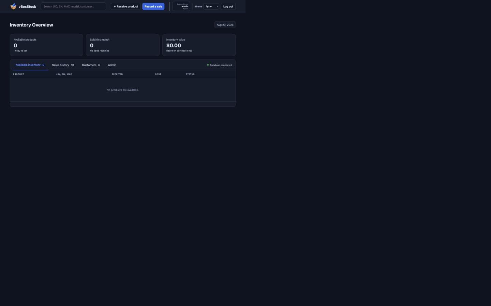
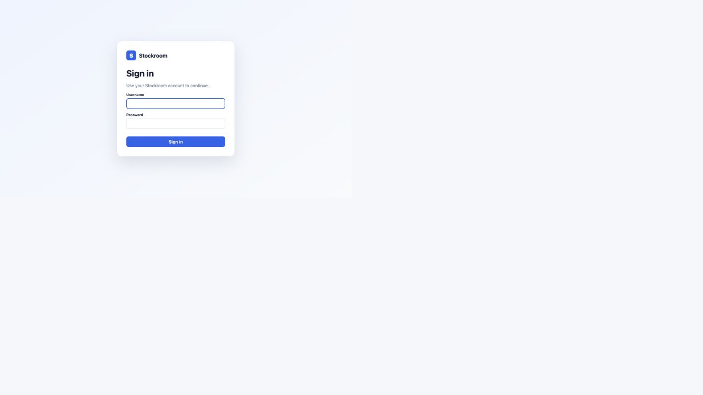
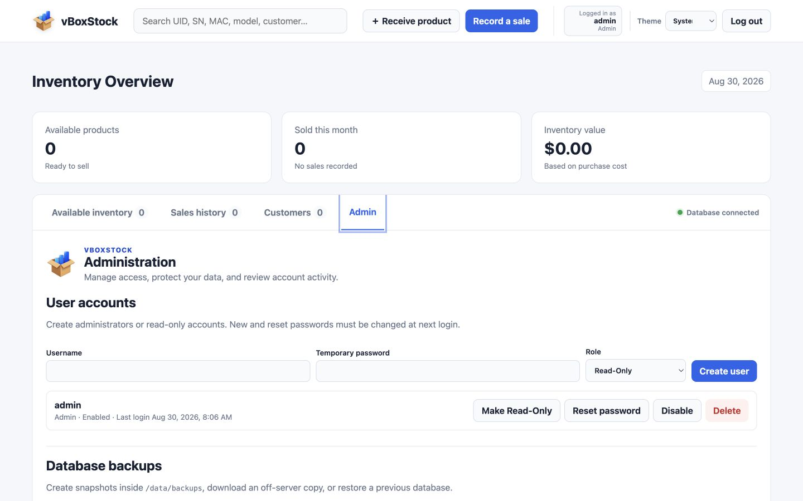

<p align="center"></p>

# vBoxStock

A small, self-hosted inventory and sales tracker for people who buy, stock, and resell vSeeBox devices.

vBoxStock replaces spreadsheets and handwritten lists with one browser-based place to track each physical unit from receipt through sale. It records the identifiers that matter for electronics inventory—UID, serial number, and MAC address—along with condition, cost, customer, payment, shipping, and support history.

It was developed with Unraid in mind, but Unraid is not required. vBoxStock is a standard OCI/Docker container and can run on a Docker-compatible Linux server, NAS, home lab, or cloud VM. The application is self-contained: the web server and SQLite database live inside one image, while durable data is stored in a mounted `/data` directory.



## Why vBoxStock exists

General inventory tools can be larger and more complicated than a small reseller needs. vBoxStock focuses on a straightforward workflow:

1. Receive an individually identifiable device into inventory.
2. Record its cost, model, condition, and notes.
3. Complete a sale with customer, payment, shipping, and transaction details.
4. Revisit the customer or sale later for support and follow-up.
5. Back up the complete business record without managing a separate database server.

## Highlights

- Track available and sold devices by UID, serial number, or MAC address.
- Support vSeeBox V3 Plus, V5 Pro, V6 Plus, and V6 Pro inventory.
- Record New, Used, or Refurbished condition and purchase cost.
- Capture customer name, phone number, shipped-to address, and shipping notes.
- Record Cash, Venmo, or PayPal payments with an optional reference.
- Attach transaction notes to a sale and time-stamped support notes to a customer.
- Browse inventory, sales, and customers in searchable 10-record pages.
- View sale details and complete purchase history for each customer.
- Void a sale and return the device to available inventory.
- Use Admin and Read-Only accounts with server-enforced permissions.
- Create, download, restore, and delete SQLite backups from the Admin page.
- Review an audit log of authentication, account administration, backups, and data changes.
- Keep all persistent application data in one mounted directory.

## Screenshots

### Secure sign-in



### User administration, backups, and audit history



## Accounts and security

On a new installation—or an upgraded installation with no configured accounts—sign in with:

- **Username:** `admin`
- **Password:** `admin`

vBoxStock immediately requires a new password and blocks access to application data until it is changed. Passwords must contain at least 8 characters and are stored as salted `scrypt` hashes, never as readable text.

| Capability | Admin | Read-Only |
| --- | :---: | :---: |
| View and search inventory, sales, customers, and notes | Yes | Yes |
| Receive inventory and record sales | Yes | No |
| Edit notes, void sales, or delete records | Yes | No |
| Manage users and view the audit log | Yes | No |
| Create, download, delete, or restore backups | Yes | No |
| Access the Admin page | Yes | No |

Additional protections include HTTP-only SameSite session cookies, a 12-hour inactivity timeout, login throttling, required password confirmation before a restore, automatic session invalidation after a restore, and protection against disabling or deleting the final enabled administrator.

For use outside a trusted private network, place vBoxStock behind an HTTPS reverse proxy. The application does not provide TLS certificates directly.

## Quick start with Docker

```sh
docker run -d \
  --name vseebox-stockroom \
  --restart unless-stopped \
  -p 3000:3000 \
  -e TZ=America/New_York \
  -v /your/persistent/path:/data \
  ghcr.io/mfwadejr/vseebox-stockroom:latest
```

Open `http://YOUR-SERVER-IP:3000`, sign in with the initial credentials above, and change the password when prompted.

The host path mounted at `/data` is essential. Removing the container is safe when this mount remains intact; running without a persistent mount means the database can be lost when the container is replaced.

## Docker Compose

The included `docker-compose.yml` stores data in `./data` alongside the Compose file:

```sh
docker compose up -d
```

To update later:

```sh
docker compose pull
docker compose up -d
```

## Unraid

Use the included `stockroom-unraid.xml` template or create a container with these settings:

| Setting | Value |
| --- | --- |
| Repository | `ghcr.io/mfwadejr/vseebox-stockroom:latest` |
| WebUI port | `3000` |
| Container data path | `/data` |
| Suggested Unraid host path | `/mnt/user/appdata/vseebox-stockroom` |
| Network mode | `bridge` |

Open the container's WebUI after installation. Updates can be applied with **Force Update** or through the CA Auto Update Applications plugin.

## Data and backups

vBoxStock uses SQLite and does not require MySQL, PostgreSQL, Redis, or another service. Persistent content is stored under `/data`:

- `/data/stockroom.db` — active application database
- `/data/backups/` — locally retained database snapshots

The Admin page can create a transactionally consistent snapshot, download it to another device, restore a local snapshot, or upload and restore a downloaded copy. A pre-restore snapshot is created automatically before the active database is replaced.

Backups contain customer information and password hashes. Store downloaded copies securely. Restoring a database also restores the user accounts contained in that backup and signs out every active session. An older backup without user accounts starts the first-login `admin` / `admin` setup flow.

## Emergency administrator recovery

If every administrator is inaccessible, run this on the Docker host, replacing the container name, username, and temporary password if needed:

```sh
docker exec -it vseebox-stockroom node server.mjs reset-admin admin NewPassword123
```

The account is enabled as an administrator and must change the supplied password on its next login. The reset is recorded in the audit log. Because command arguments may briefly appear in process listings, the password can instead be supplied through an environment variable:

```sh
docker exec -e RESET_ADMIN_PASSWORD=NewPassword123 -it vseebox-stockroom node server.mjs reset-admin admin
```

## Container details

- Image: `ghcr.io/mfwadejr/vseebox-stockroom:latest`
- Application port: `3000/tcp`
- Persistent volume: `/data`
- Health check: `GET /api/health`
- Runtime: Node.js 22
- Database: SQLite
- Restart policy recommendation: `unless-stopped`

## Intended scope

vBoxStock is designed for a single reseller or small team operating one shared installation. It is not an accounting platform, payment processor, shipping-label service, or public storefront. Payment details are records of how a sale was accepted; vBoxStock does not connect to Cash, Venmo, or PayPal or move money itself.

## Updating and versioning

The `latest` image follows the current stable release. Patch releases contain fixes and small refinements, minor releases add backward-compatible features, and major releases may change setup or access behavior. Keep `/data` persistently mounted and create or download a backup before significant upgrades.
